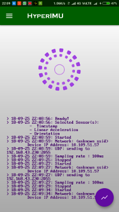
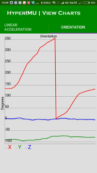
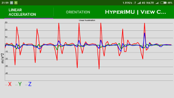

# Person Following Robot using HyperIMU

A ROS-based person-following system for mobile robots. A smartphone mounted on the user's foot streams IMU data wirelessly to the robot, which performs **Pedestrian Dead Reckoning (PDR)** to estimate the person's position and autonomously follows their path.

## How It Works

```
[Phone (foot-mounted)]  --UDP-->  [ROS PC]  -->  [Mobile Robot]
   HyperIMU App                himu_sensor.py    goal_data.py
   (Accel + Orientation)       (PDR Algorithm)   (move_base goal)
```

1. The **HyperIMU** Android app streams linear acceleration and orientation data over UDP
2. `himu_sensor.py` receives packets and runs a step-detection + dead-reckoning loop:
   - Buffers one second of acceleration readings
   - Detects a step if peak linear acceleration exceeds 4 m/s²
   - Estimates step distance from peak acceleration magnitude
   - Computes X/Y displacement using the phone's orientation
   - Accumulates a running position estimate and publishes it to `/position`
3. `goal_data.py` subscribes to `/position` and forwards each update as a `move_base` navigation goal, making the robot chase the user's trail

### Step Distance Heuristic

| Peak Acceleration | Estimated Step Distance |
|---|---|
| 4 – 12 m/s² | 0.70 m |
| 12 – 15 m/s² | 0.90 m |
| 15 – 25 m/s² | 1.00 m |
| ≥ 25 m/s² | 1.50 m |

## ROS Topics

| Topic | Type | Published by | Description |
|---|---|---|---|
| `/linAcc` | `geometry_msgs/Vector3` | `himu_sensor.py` | Raw linear acceleration (x, y, z) |
| `/orient` | `geometry_msgs/Vector3` | `himu_sensor.py` | Orientation offset from initial heading |
| `/position` | `geometry_msgs/Vector3` | `himu_sensor.py` | Accumulated X/Y position estimate |
| `/angle` | `geometry_msgs/Quaternion` | `himu_sensor.py` | Heading as quaternion |

## Requirements

- **Robot:** ROS Kinetic (or later) with a mobile base running the `move_base` navigation stack (e.g., TurtleBot 2/3, or any compatible robot)
- **Phone:** Android device with the [HyperIMU](https://play.google.com/store/apps/details?id=com.ianovir.hyper_imu) app installed
- **Network:** Phone and robot PC on the same WiFi network (a phone hotspot works well)

### Python Dependencies

```
rospy
actionlib
geometry_msgs
move_base_msgs
tf
```

These are all standard packages included with a full ROS desktop install.

## Setup

### 1. Configure the HyperIMU App

Enable the following sensor packets in the app with **timestamp** enabled:

| App Home | Orientation | Linear Acceleration |
|---|---|---|
|  |  |  |

Set the **host** to your robot PC's IP address and **port** to `2055`.

### 2. Configure the ROS Node

Edit `himu_sensor.py` and set the host IP to match your robot PC's IP on the shared network:

```python
host = "192.168.43.230"  # replace with your robot PC's IP
port = 2055
```

Alternatively, pass it as a ROS parameter at launch:

```bash
rosrun person_follow himu_sensor.py _host:=192.168.43.230
```

### 3. Mount the Phone

Strap the phone to the **top of your foot** with the screen facing up. Foot-mounting maximizes the acceleration signature of each step, making step detection more reliable.

## Usage

```bash
# Terminal 1: Start your robot's navigation stack
roslaunch turtlebot_navigation amcl_demo.launch

# Terminal 2: Start both person-follow nodes with a single command
roslaunch person_follow person_follow.launch
```

Open the HyperIMU app on your phone, tap **Start**, and walk — the robot will follow your path.

> **Tip:** Stand still for a moment after launching so the node can capture the initial heading (`thetaZero`) before you start moving.

## Project Structure

```
├── launch/
│   └── person_follow.launch  # Start all nodes with one command
├── src/
│   ├── himu_sensor.py        # UDP receiver + Pedestrian Dead Reckoning
│   ├── goal_data.py          # ROS move_base goal publisher
│   └── singleGoal.py         # Standalone single-goal client (utility)
├── img/                      # HyperIMU app setup screenshots
├── CMakeLists.txt
├── package.xml
└── README.md
```

## Limitations

- **Dead reckoning drift:** Position error accumulates over time with no loop-closure correction. Works best for short to medium distances.
- **Step detection threshold:** The 4 m/s² threshold and distance heuristics are tuned for a typical walking gait. Running or unusual gaits may reduce accuracy.
- **No obstacle avoidance tuning:** The robot relies entirely on the `move_base` costmap configuration for obstacle avoidance; the PDR goals are sent without look-ahead.
- Requires Python 2 (ROS Kinetic/Melodic era).

## License

MIT License — see [LICENSE](LICENSE) for details.
